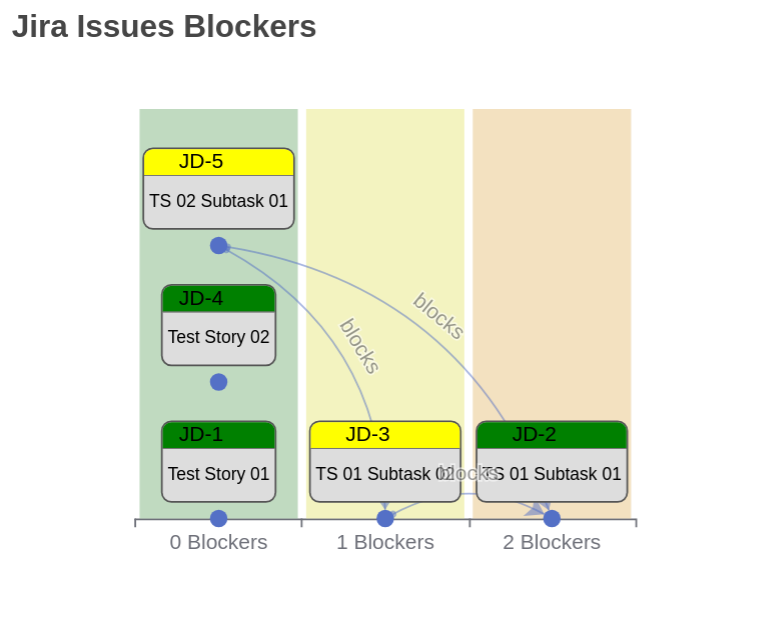

# About
This is a Tampermonkey user script for Jira Kanban boards.

This script adds a new menu item to Tampermonkey browser plugin.

When clicking on that menu item while on a Jira Kanban board, the userscript will add a graph on top of the board that shows the blocker dependencies between the board's Jira issues and other non present on the board, if required.

# Setup
- Install Tampermonkey plugin on your browser.
- Enable Developer Mode on your browser, if required.
- Import or copy-and-paste the userscript.js on this same repo.

# Usage
- Create or modify some Jira issues in order to add "Blocker for" or "Blocked by" link dependencies to other Jira issues.
- Verify that those modified issues will show on a certain Jira Kanban board.
- Go to that Jira Kanban, e.g. 
`http://jira.mycompany.com/secure/RapidBoard.jspa?rapidView=<boardId>&projectKey=<projectId>&view=detail` 
- Click on the Tampermonkey browser extension icon.
- Click on the **Jira - Blockers chart** menu item.

# Example
This is an example of a demo chart generated by following the previous steps:

